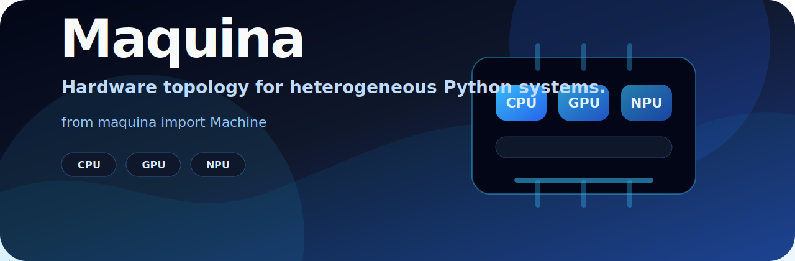

<h1>
  <a href="https://github.com/phvv-me/maquina/">
    <picture>
      <source srcset="src/maquina/assets/banner.svg" type="image/svg+xml">
      
    </picture>
  </a>
</h1>

<h1 align="center">

[](https://github.com/phvv-me/maquina/actions/workflows/ci.yml)
[](https://pypi.org/project/maquina/)
[](https://phvv.me/maquina)
[](LICENSE)

</h1>

# Maquina: Hardware Topology for Python

> [!WARNING]
> **Maquina is early (`0.0.x`).** The Python API is small on purpose, but provider details may still change.

Maquina tells Python code what compute units are on the current machine without assuming the world is only CUDA. It models CPUs, GPUs, and NPUs as `Unit`s, exposes snapshots with shared semantics, and keeps vendor-specific probing behind providers.

## Installation

```sh
pip install maquina
```

On Linux machines with NVIDIA GPUs, install the CUDA provider extra:

```sh
pip install "maquina[nvidia]"
```

For a persistent CLI tool install:

```sh
uv tool install maquina
```

## Terminal View

```sh
maquina
python -m maquina
maquina --color=False
```

## Python API

```python
from maquina import Machine

machine = Machine()
machine.cpu.snapshot()
machine.gpus[0].snapshot()
machine.units
```

The API models CPU, GPU, and NPU hardware as `Unit`s with shared identity and snapshot semantics. Providers are isolated under `providers/`; Apple and NVIDIA are implemented, while AMD, Intel, and Qualcomm are import-safe stubs for future CI and hardware work.

## Platforms

| platform | status |
|---|---|
| Apple Silicon macOS | CPU, Apple GPU, and Apple Neural Engine detection |
| Linux + NVIDIA CUDA | CPU and NVIDIA GPU detection |
| Other platforms | CPU fallback plus inert future-provider stubs |

## Development

```sh
pixi run maquina
pixi run python -m pytest common/maquina/tests -q
```

Full documentation lives at **[phvv.me/maquina](https://phvv.me/maquina)**.
