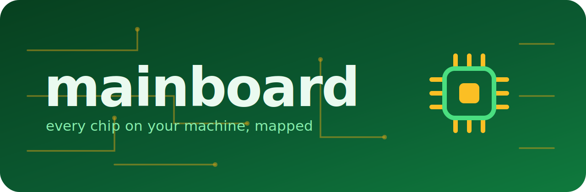

<h1>
  <a href="https://github.com/phvv-me/mainboard/">
    <picture>
      <source srcset="docs/assets/banner.svg" type="image/svg+xml">
      
    </picture>
  </a>
</h1>

<h1 align="center">

[](https://github.com/phvv-me/mainboard/actions/workflows/ci.yml)
[](https://pypi.org/project/mainboard/)
[](https://phvv.me/mainboard)
[](LICENSE)

</h1>

# Mainboard: Hardware Topology for Python

> [!WARNING]
> **Mainboard is early (`0.0.x`).** The Python API is small on purpose, but provider details may still change.

Mainboard tells Python code what compute units are on the current machine without assuming the world is only CUDA. It models CPUs, GPUs, and NPUs as `Unit`s, exposes snapshots with shared semantics, and keeps vendor-specific probing behind providers.

## Installation

```sh
pip install mainboard
```

On Linux machines with NVIDIA GPUs, install the CUDA provider extra:

```sh
pip install "mainboard[nvidia]"
```

For a persistent CLI tool install:

```sh
uv tool install mainboard
```

## Terminal View

```sh
mainboard
python -m mainboard
mainboard --color=False
```

## Python API

```python
from mainboard import Machine

machine = Machine()
machine.cpu.snapshot()
machine.gpus[0].snapshot()
machine.units
machine.environment            # user, group(s), and job scheduler on the host
machine.model_dump_json()      # one-call JSON probe of the whole machine
```

The API models CPU, GPU, and NPU hardware as `Unit`s with shared identity and snapshot semantics. Providers are isolated under `providers/`; Apple and NVIDIA are implemented, while AMD, Intel, and Qualcomm are import-safe stubs for future CI and hardware work. `Machine().model_dump_json()` probes the whole host in one call, including its execution environment (user, group, and job scheduler).

## Platforms

| platform | status |
|---|---|
| Apple Silicon macOS | CPU, Apple GPU, and Apple Neural Engine detection |
| Linux + NVIDIA CUDA | CPU and NVIDIA GPU detection |
| Other platforms | CPU fallback plus inert future-provider stubs |

## Development

```sh
pixi run mainboard
pixi run python -m pytest common/mainboard/tests -q
```

Full documentation lives at **[phvv.me/mainboard](https://phvv.me/mainboard)**.
