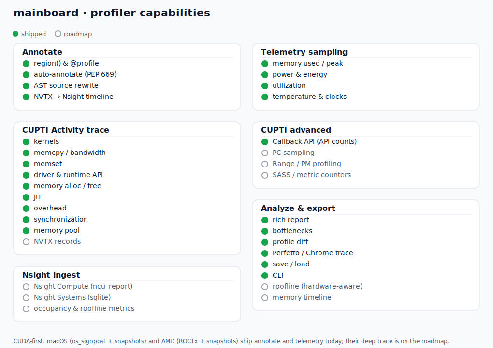

# Profiling

Mainboard exposes one `Profiler`, one immutable `Profile`, and one dormant `span`
annotation. A span describes application structure. It never chooses clocks, memory
sampling, native markers, or GPU collectors. The active profiler owns those choices.



## The contract

Feature flags decide what may be collected. Observed evidence decides what appears in
the result.

* Python samples appear only when Python 3.15 Tachyon ran successfully
* Span timing appears only when `SPANS` was selected and a span executed
* Device telemetry appears only when the target process was present on that device
* GPU activity appears only when kernels, copies, or other native records were captured
* Unsupported or unused collectors do not add empty or unavailable sections

A machine merely having a GPU is not evidence that the profiled code used it.

## Dormant annotations

Use `span` as a context manager, a bare decorator, or a named decorator.

```python
from mainboard.profiling import Profiler, span

@span
def load() -> None:
    ...

@span("forward")
def predict() -> None:
    ...

with Profiler(features=Profiler.Feature.SPANS) as profiler:
    with span("request"):
        load()
        predict()

profiler.show()
```

The annotation accepts only a name. Collection policy belongs to `Profiler`. Without
an active profiler, a decorated function performs one active session check and calls
the original function directly. It does not read a clock or a context variable.

Nested paths use dotted names such as `request.forward`. Context variables keep
nesting independent across threads and asyncio tasks. The session stores at most
`max_spans` raw measurements and at most 4096 device samples per live span.

Native marker backends use correlatable start and end ranges for profiler spans. Each
span closes its own range, so overlapping asyncio tasks do not corrupt a thread-local
push and pop stack.

## Feature flags

`Profiler.Feature` is a `Flag` enum and values combine with `|`.

| Feature | Collection cost and result |
|---|---|
| `PYTHON` | External Python 3.15 statistical sampling for launched or attached targets |
| `SPANS` | Wall time for executed `span` annotations |
| `DEVICE` | Background target process GPU telemetry while spans are open |
| `MARKERS` | NVTX, ROCTx, or signpost ranges for active spans |
| `ACTIVITY` | Asynchronous native kernels and memory copies through the vendor backend |
| `DEFAULT` | Every feature above |

Choose the smallest set that answers the question.

```python
timing = Profiler.Feature.SPANS
timeline = timing | Profiler.Feature.MARKERS
gpu = timeline | Profiler.Feature.DEVICE | Profiler.Feature.ACTIVITY

with Profiler(features=timing) as profiler:
    work()
```

In a local July 2026 measurement, a direct call took 13.9 ns and the same dormant
decorated call took 45.5 ns. The incremental dormant cost was 31.6 ns. An active timed
decorator call took 3.56 microseconds and an active timed context took 3.75
microseconds. These measurements exclude device and native activity collectors and
should be repeated on the deployment host with the benchmark suite.

## Profile one target once

`Profiler.run` accepts a module name or a Python script path. Local collectors run in
the target process. Tachyon wraps that same process from the outside when Python 3.15
sampling is available. The target is never run once per collector.

```python
profile = Profiler.run("package.train")
profile.show()
profile.save("train.mbprof")
```

```sh
mainboard profile run package.train
mainboard profile run train.py --no-activity --no-device
```

The command exposes one boolean toggle per feature. This makes an overhead comparison
explicit without changing application annotations.

## Python 3.15 sampling

Python sampling uses the standard library `profiling.sampling` command internally.
Mainboard does not expose a second Tachyon client or Python profiler class.

Tachyon supports wall, CPU, GIL, and exception sampling. It can produce pstats,
collapsed stacks, flamegraphs, Gecko profiles, heatmaps, and binary captures. Attach
requires the profiler and target to use the same Python minor version. Prerelease
builds require the exact same release. Free threaded and regular builds must also
match.

Attaching may require ptrace permission on Linux, root or a debugger entitlement on
macOS, and administrator debug permission on Windows. A normal production capture is
usually bounded to 10 through 30 seconds.

```sh
mainboard profile attach 1234 --duration 20
mainboard profile dump 1234
```

When Python sampling is unavailable, normal `run` continues with selected local
collectors. Pass `strict=True` to the Python API when absence must fail before the
target starts.

## Automatic spans

`Profiler(auto=("package.module",))` uses `sys.monitoring`. Mainboard discovers code
objects owned by the selected module and enables local events only for those code
objects. It does not run a Python predicate for every function call in the process.
Exceptional unwinds use the global unwind event because CPython does not allow that
event in a local event set. The callback immediately ignores code outside the selected
set.

Explicit `span` annotations remain easier to read and have the smallest dormant cost.
Automatic spans are useful for a bounded investigation of code that cannot be edited.

## Process GPU evidence

Device snapshots are retained only when their process list contains the current target
PID. Mainboard replaces device wide used memory with that process resident GPU memory
before aggregating the span. This prevents another job on the same GPU from making a
CPU only target look like a GPU workload.

Providers that cannot identify device processes omit device telemetry. Native activity
records are independent evidence and may still produce a GPU activity section.

## CUPTI activity lifecycle

The NVIDIA backend uses CUPTI Activity. It does not enable counter replay, PC sampling,
or synchronous runtime callbacks for the normal profile. Kernel and memory copy records
arrive through asynchronous buffers.

The completion callback copies only fields whose CUPTI lifetime ends with the callback.
It writes compact raw records into a bounded 262144 record deque. Pydantic model
construction and API name resolution happen when the result is read. When capture ends,
Mainboard synchronizes once, flushes buffered records, removes the active collector, and
disables every activity kind that capture enabled.

Use `Profiler.Activity.DEFAULT` for kernels and copies. `Profiler.Activity.ALL` adapts to the kinds the
device supports. Explicit unsupported kinds fail before collection begins.

```python
from mainboard.profiling import Profiler, span

features = Profiler.Feature.SPANS | Profiler.Feature.MARKERS | Profiler.Feature.ACTIVITY

with Profiler(features=features, activities=Profiler.Activity.DEFAULT) as profiler:
    with span("matmul"):
        work()

profile = profiler.result()
profile.trace_report()
profile.perfetto("trace.json")
```

## Read and compare results

`Profile` is pure data. It can be saved, loaded, rendered, compared, or exported after
all collectors have stopped.

```python
before = profiler.result()
before.save("before.mbprof")

after = Profiler.run("package.train")
after.diff(Profile.load("before.mbprof")).show()
after.perfetto("trace.json")
```

`stats()` collapses repeated span paths. `bottlenecks()` returns the slowest paths.
`trace_report()` attributes GPU activities to the narrowest enclosing span window.
`dropped_spans` and `dropped_activities` report bounded capture overflow instead of
allowing an unbounded log.
